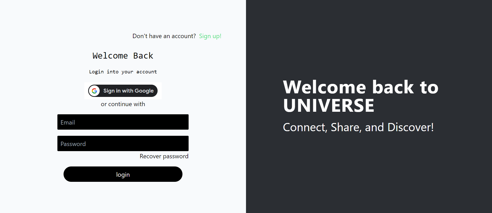

# UNIVERSE--backend


<div align="center">
  
</div>


[](https://github.com/prabhath-kj/uniVERSE--backend/blob/main/LICENSE)
[](https://github.com/prabhath-kj/uniVERSE--backend/issues)
[](https://github.com/prabhath-kj/uniVERSE--backend/pulls)
[](https://github.com/prabhath-kj/uniVERSE--backend/stargazers)
[](https://github.com/prabhath-kj/uniVERSE--backend/network)

**UNIVERSE--BACKEND** is the backend component of the uniVERSE project, designed to provide essential functionality for a versatile application. This repository serves as the backend service, handling data management, user authentication, and other server-side tasks.

## Table of Contents

- [Getting Started](#getting-started)
- [Features](#features)
- [Package Dependencies](#package-dependencies)
- [License](#license)

## Getting Started

To get started with **uniVERSE--backend**, follow these steps:

1. Clone the repository to your local machine:

   ```
   git clone https://github.com/prabhath-kj/uniVERSE--backend.git
2. Install the necessary dependencies:
   ```
   cd uniVERSE--backend
   npm install
3. Start the server:
   ```
   npm start

## Features

- User Authentication: Secure user registration and login system.
- Data Management: Manage and retrieve data for the uniVERSE application.
- Customizable: Easily extend and customize the backend to suit your project's needs.
- RESTful API: Built on a RESTful API architecture for simplicity and compatibility.

## Package Dependencies

    "bcrypt": "^5.0.1",
    "cloudinary": "^1.37.3",
    "cors": "^2.8.5",
    "dotenv": "^16.3.1",
    "express": "^4.18.2",
    "google-auth-library": "^8.8.0",
    "googleapis": "^123.0.0",
    "helmet": "^7.0.0",
    "jsonwebtoken": "^9.0.0",
    "mongoose": "^7.3.1",
    "mongoose-deep-populate": "^3.2.0",
    "mongoose-findorcreate": "^4.0.0",
    "multer": "^1.4.5-lts.1",
    "nodemailer": "^6.9.3",
    "passport": "^0.6.0",
    "passport-jwt": "^4.0.1",
    "socket.io": "^4.7.1"


## License

This project is licensed under the MIT License - see the LICENSE file for details.


